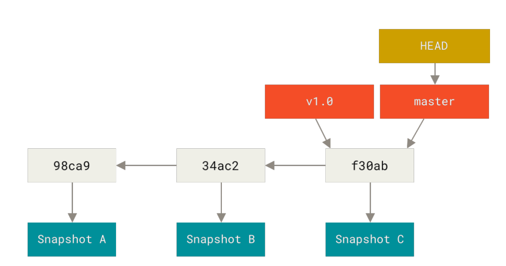

# Git
[back to main index](../README.md)

## General
* **git** is based on stroring **snapshots**, not differences
* every operation is local
* everything is checksumed (SHA-1)
* a lifecycle of every file is following:
  

* `index` is proposed next commit snapshot, that means all files that will go in next commit
* typical workflow looks following:
  
* files matches by pattern in `.gitignore` are ignored
* `--cached` == `--staged`
* `master` for default branch and `origin` for default remote are just naming conventions, there is nothing special about those names
* **commits** as a pointer to snapshot which can consist of many trees (one tree represent one directory), trees are holding pointers to blobs which represent files
  
* each commit points to a **snapshot** and **parent commit**
  
* `branch` is a pointer to specific commit, and nothing more than that
* `HEAD` is last commit snapshots, normally it points to some branch
* 
* `detached head` means that `HEAD` is not pointing to any branch
* all files(blobs) are stored as object under SHA-1 hash
* if files are common between snapshots, they are shared:
    

## Workflow
* to initialize repo use `git init`
* to check status of files use `git status`
  * `git status -s` for short output
* `git add` adds files to the index, it adds the file to staging area, but it is also used to **start tracking files** (as side effect kinda)
* to see how file how been modified use `git diff`
  * to see what diffs are stages use `git diff --staged`
* to commit what is staged in index, use `git commit -m "commit message"`
  * to stage all modified files in one step add `-a` flag: `git commit -a -m "message"`
* to remove file use `git rm file`, it does 2 things:
  * untracks file
  * removes file from the harddrive
* to untrack file but keep it on disk use `git rm --cached <file>`
* to move file use `git mv <fromFile> <toFile>`
* to see the commit history use `git log`
  * `git log --graph` prints pretty tree
*  to modify the last commit that has not been pushed yet, use `git commit --amend`
   *  it can update the files and commit message
* to unstage staged file on unmodify modified file use `git restore <file>`, 
  * basic version unmodifies file while `git restore --staged <file>` unstages
* to work with remotes there is `git remote` command, in basic form it displays added remote
  * for move verbose output use `git remote -v`
  * to add remote `git remote add <name> <url>`
  * to fetch info from given remote `git fetch <name>`, you can also pull by `git pull <name>`
  * to get more detailed information about given remote, like branch tracking info use `git remote show <remote>`
  * renaming: `git rename <oldName> <newName>`
  * removing: `git remote remove <remote>`
* **tags** are pointers to specific commits, there are 2 types of tags in git:
  * **lightweight** which are similiar to branches, there are just pointers
  * **annotated** tags which are objects and can store additional data
* refer to docs as there are a lot of commands
* keep in mind that tags must be pushed separately, they are not pushed when branch is pushed
* **git aliases** are a way to create shortcut(alias) for existing command
* to check what is active branch use `git branch`
  * for get more info use `git branch -all`
  * to get all tracking information use `git branch -vv`
* to create new branch use `git branch <name>`
* to switch between branches (repoint HEAD) use `git checkout <name>`
* to create a branch and checkout to it in one step use `git checkout -b <name>`
  * to create a new branch based on one on remote use `git checkout -b <name> <remote/name>`
    * the shortcut for that is `git checkout --track <remote/name>`
    * or even `git checkout <name>` if there is one remote with given branch name 
* to merge different branch to current branch use `git merge <name>`
* to delete give branch use `git branch -d <name>`
* to rename branch use `git branch --move <oldName> <newName>`
* to push specific branch use `git push <remote> <branch>`
  * to set tracking on remote add `--set-upstream` flag
* **rebasing** is applying series of commits to another branch since common parent commit
  * to rebase go to branch that you want to rebase from and use `git rebase <branchRebased>`
    * you dont need to checkout to target branch by `git rebase <targetBranch> <branchRebased>`
    * usually after rebase you will want to fast-forward merge the target branch to move the pointer `git merge <targetBranch>`
  * rebase can be viewed as alternative to merge
  * you can also rebase if there is no common parent commit: `git rebase --onto <targetBranch> <branchWithCommonCommit> <branchBeingRebased>`
* while `git checkout` resets to which branch HEAD is pointing, `git reset` resets to which commit the branch pointed by HEAD is pointing
  * great explanation is in proGit book
  * `git reset --soft` resets only to which commit the branch is pointing, index and working directory are left untouched
  * `git reset [--mixed]` which is default option, does the previous stuff + it resets the index to snapshot which HEAD is now pointing
  * `git reset --hard` does the previous + resets also working directory to new index, which may LOSE the data, hence its the only one reset that may be dangerous