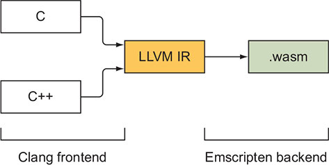
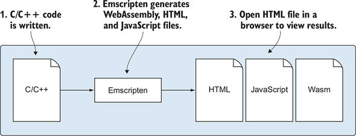

# Emscripten
[back to main index](./WebAssembly.md)

## General
- backend of LLVM, uses Clang as frontend

- usually generates
  - **wasm** module file
  - **js** plumbing file
    - downloads Wasm module
    - instantiates module
    - contains implementation of C standard library and others
    - if function from library needs to be exported and is not used by **wasm**, declare it explicitly
  - **html** webpage file
  - example: 
- approaches:
  - **wasm** + **js** + **html**
    - good for prototyping
    - rarely used in production
  - **wasm** + **js** 
    - most used
    - contains C library
    - .js can be run directly by runtimes like Node
  - **wasm** (sometimes called **standalone**)
    - this generates so called **side module**
    - minimalistic approach, no Emscripten runtime (and no C library support in effect)
    - used for **dynamic linking** of multiple modules
      - usually multiple **side modules** are linked with **main module**, which contains Emscripten runtime and C library 
    - .wasm can be run by runtimes like Node + manually written .js loading code 
  - for passing anything more than `int` or `float` between modules, memory managment is required which usually is achieved with C library support (`malloc()`, `free()`)
-  it adds custom definition which can be checked
    ```cpp
    #ifdef __EMSCRIPTEN__      
      #include <emscripten.h>   
    #endif
    ```

## Side module vs main module
- `-s SIDE_MODULE/MAIN_MODULE=<VAL>`
  - 1 - enables
  - 2 - enables and optimizes unsued symbols
    - to keep symbols alive do one of two:
      - mark symbol in code with `EMSCRIPTEN_KEEPALIVE`
      - specify symbol in `EXPORTED_FUNCTIONS` while compiling/linking
        - `-s EXPORTED_FUNCTIONS=_<function1>,_<function2>`
- **SIDE_MODULE** does not require `main()`


## Calling Emscripten
- by default, Emscripten generates **wasm** + **js** files
- to generate also **html** file add `-o <filename>.html`
  - `-o` stand for output
- to generate only **wasm** file add `-o <filename>.wasm`