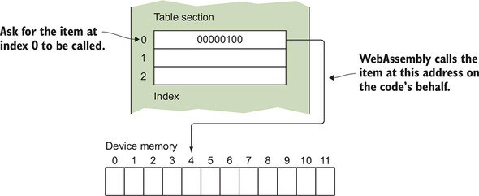
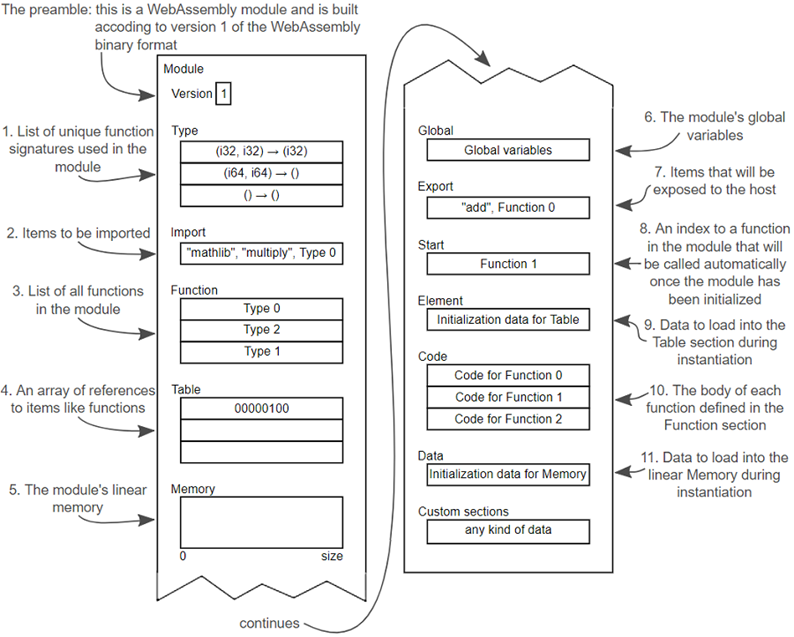

# Module Structure
[back to main index](./WebAssembly.md)

## General
- module starts with **preamble**, which indicates version of **Wasm**
- modules can contain [0, n] **sections** (all sections are optional, module can be empty)
  - **named** sections
    - must appear at specific place
    - is validated
  - **custom** sections
    - can appear anywhere
    - may share section name
    - example: **name** section with symbols names for debugging
- there is **WebAssembly Text Format (WAT)**
  - human readable representation using **s-expressions**

## Structure
- **Types** - list of unique function signatures that will be used in module (includes imports)
- **Import** - all imports used in module (Functions, Table, Memory, Global imports)
- **Functions** - list of all functions in module. Position in the list represent the index of function body in **Code**. Value represent corresponding type from **Types**.
- **Table** - typed list of references, that can't be stored in linear memory (every access is bound check)

- **Memory** - linear memory of module (ArrayBuffer)
  - each page is 64KB
  - multiple instances of Wasm module can share the same **Memory**
- **Global** - global variables definitions
- **Export** - list of objects exported to host, once the module is instantiated
- **Start** - index of entry point function
  - can be used for initialization
  - this function is called before any of exports are callable by JS host
  - if there is `main()` then **Start** will be set to it
- **Element** - data loaded into **Table** during instantiaton
- **Code** - body of functions
- **Data** - data loaded into **Memory** during instantiaton

## Layout

