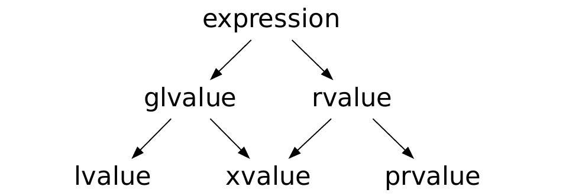

# Value Categories
[back to index](../README.md)

## General
- each **expression** is characterized by two independent properties: a **type** and a **value category**
- each expression has some **non-reference type**, and each expression belongs to exactly one of the three primary value categories: **prvalue**, **xvalue**, and **lvalue**
- there are also mixed categories which aggregate the primary ones:
  - **lvalues** and **xvalues** compromise **glvalues** (Generalized Lvalue)
  - **xvalues** and **prvalues** compromise **rvalues**
    

## For detailed information about categories check [cpp reference](https://en.cppreference.com/w/cpp/language/value_category)

## Basic Categories
### lvalues
- address of an **lvalue** may be taken by built-in address-of operator (&)
- **modifiable lvalue** may be used as the left-hand operand of the built-in assignment and compound assignment operators
- even if the variable type is **rvalue reference**, the expression consisting it's name is **lvalue**
- function call which return type is **lvalue reference**, is **lvalue**

### xvalues (eXpiring)
- function call which return type is rvalue reference to object (like `std::move`), is **xvalue**
- any expression that designates a **temporary object**, after **temporary materialization** (since C++17)

### prvalues (Pure Rvalues)
- cannot be **polymorphic** or have **incomplete type**
- there are mainly **literals** and results of simple expressions

## Mixed Categories

### glvalue = lvalue + xvalue (Generalized Lvalue)
- glvalue may be implicitly converted to a prvalue with lvalue-to-rvalue, array-to-pointer, or function-to-pointer implicit conversion
- may be **polymorphic** or have **incomplete type**

### rvalue = xvalue + prvalue
- address of an **rvalue** cannot be taken by built-in address-of operator
- rvalue can't be used as the left-hand operand of the built-in assignment operator
- rvalue may be used to initialize an rvalue reference, in which case the lifetime of the object identified by the rvalue is extended until the scope of the reference ends
- when used as a function argument and when two overloads of the function are available, one taking rvalue reference parameter and the other taking lvalue reference to const parameter, an rvalue binds to the rvalue reference overload